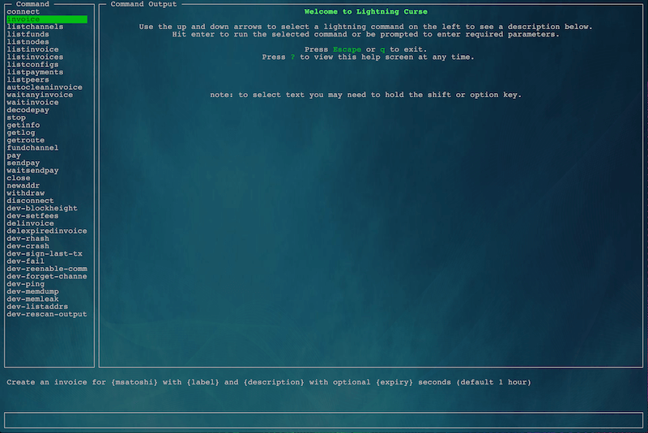

# Lightning Curse

This is a simple curses GUI for the lightning-cli for the Blockstream c-lightning Lightning Network implementation.

## Getting Started



These instructions will get you a copy of the project up and running on your local machine for development and testing purposes.

### Prerequisites

This software will only be of use to people that have a bitcoin node (or access to one) and a Lightning Network node running. Additionally, you'll need to have nodejs (including npm).

```
Give examples
```

### Installing

Installation of Lightning Curse is extremely simple. There are only two steps.
* Clone this repository

```
git clone https://github.com/craigsailor/lightning_curse
```

* Install the required libraries

```
cd lightning_curse
npm install
```

Now that you've done that, start it with the command `npm start`

One footnote: you do need to configure the deps/_settings.json with the full path to your lightning-cli binary. But don't worry. If you don't the software will tell you that.


## Built With

* [Blessed](https://github.com/chjj/blessed/) - A curses-like library with a high level terminal interface API for node.js.
* [PrettyJSON](https://github.com/rafeca/prettyjson/) - Package for formatting JSON data in a coloured YAML-style.
* Love

## Contributing

Please read [CONTRIBUTING.md](https://gist.github.com/PurpleBooth/b24679402957c63ec426) for details on our code of conduct, and the process for submitting pull requests to us.

## Authors

* **Craig Sailor** - *Initial work*

## License

This project is licensed under the MIT License - see the [LICENSE](LICENSE) file for details

## Acknowledgments

* Anyone that loves curses like me


